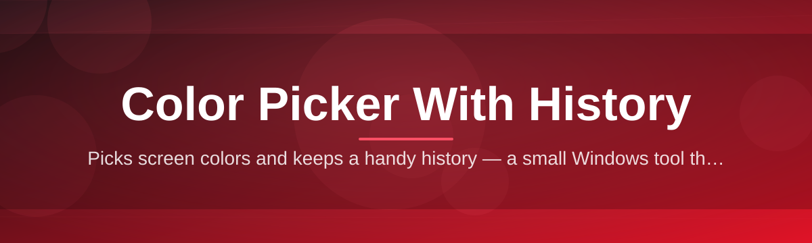
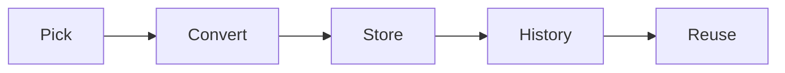

# color-picker-history-manager 🎨🕘

  

*A pixel-perfect color picker that remembers every shade you've ever plucked from the screen.*

  

## 🌈 Overview

Every designer, developer, and digital tinkerer has lived this moment: you sample a color, love it, move on — and then twenty minutes later you need that *exact* hex value again, except it's gone, swallowed by clipboard amnesia. **color-picker-history-manager** exists to end that cycle. It's a lightweight Windows utility built around one deceptively simple idea — a color picker that never forgets. Every sample you take is logged, timestamped, and instantly recallable, turning a disposable action into a searchable, reusable palette library.

This tool sits at the intersection of two workflows that usually live in separate apps: the quick eyedropper grab and the long-term swatch archive. Instead of forcing you to copy hex codes into a text file or a sticky note, color-picker-history-manager quietly builds your personal color history in the background, ready whenever inspiration (or a deadline) strikes again. Whether you're matching brand colors across a slide deck, debugging a CSS gradient, or just chasing the perfect shade of sunset-orange for a hobby project, the history panel becomes your color memory palace.

It's built for UI/UX designers, front-end developers, digital illustrators, streamers building overlays, and anyone who has ever muttered "wait, what was that blue again?" No accounts, no cloud sync required, no subscription — just a fast, focused, standalone tool that respects your desktop and your time.

---

## 🧰 What's in the Toolbox

> [!TIP]
> Each capability below was shaped by real feedback from the community — this is a living feature set, not a fixed spec.

- **Screen-wide eyedropper** — sample any pixel on any monitor, across any application, with pixel-level zoom for precision picking.

- **Persistent color history** — every pick is saved automatically in a scrollable, searchable timeline, so nothing you sample is ever truly lost.

- **Multi-format output** — instantly view and copy HEX, RGB, HSL, and CMYK values for any sampled color, no manual conversion required.

- **Named palettes & favorites** — pin your best finds into custom-named palettes for branding, projects, or moodboards.

- **Smart duplicate detection** — near-identical shades are grouped intelligently so your history stays clean instead of cluttered.

- **One-click clipboard copy** — grab any historical color in your preferred format with a single click, no re-picking needed.

- **Lightweight & dependency-free** — a standalone Windows executable that starts fast and stays out of your way.

- **Local-first storage** — your color history lives on your machine, under your control, with no forced cloud account.

---

## 🚀 Getting Rolling

1. Visit the project landing page via the download button above.

2. Grab the latest Windows build — no installer wizard gauntlet, just a clean standalone app.

3. Launch the executable and pin it to your taskbar for instant access.

4. Start sampling colors — your history builds itself from your very first pick.

> [!NOTE]
> First launch may take a second longer while the app initializes your local history database. This is normal and only happens once.

---

## 🖥️ System Requirements

| Requirement | Details |
|---|---|
| **OS** | Windows 10 (64-bit) or Windows 11 |
| **Dependencies** | None — fully standalone executable |
| **Disk space** | Under 50 MB |
| **RAM** | 100 MB typical usage |
| **Internet** | Not required after download |

> [!IMPORTANT]
> This is a Windows-native tool. There is currently no macOS or Linux build — it's on the community roadmap, discussed below.

---

## ⚙️ How It Works

The architecture is intentionally simple — a thin, responsive front end backed by a lightweight local history engine:

1. **Capture** — the eyedropper reads pixel color data directly from your screen buffer.

2. **Convert** — the raw pixel value is translated into HEX, RGB, HSL, and CMYK simultaneously.

3. **Store** — the color, along with a timestamp, is written into your local history log.

4. **Recall** — the history panel indexes entries for instant search, filtering, and re-copy.

5. **Export** — favorited palettes can be reviewed and reused across future sessions.

---

## 🩹 Troubleshooting

**Q: The eyedropper isn't picking accurate colors on my second monitor.**
A: Make sure your Windows display scaling is consistent across monitors — mismatched DPI settings can skew pixel sampling.

**Q: My color history disappeared after an update.**
A: History is stored locally; check that you're launching the tool from the same folder as your previous version — moving the executable can separate it from its data file.

**Q: Can I merge history from two different machines?**
A: Not natively yet — this is an open discussion topic on our roadmap. Manual export/import is on the wishlist.

**Q: The app won't launch and nothing happens.**
A: Confirm you downloaded the correct build for 64-bit Windows and that no antivirus heuristic is quarantining the executable on first run.

**Q: Copied HEX value has an extra character.**
A: Double-check your clipboard format setting in the UI — some workflows expect a leading `#`, others don't; this is configurable.

---

## 🎹 Interface & Interaction

The interface leans minimal — a floating picker, a slide-out history drawer, and a settings panel that stays out of your creative flow. Light and dark themes are both available, and the accent color of the UI itself can be customized (yes, the color picker's own interface is themeable).

<strong>Keyboard Shortcuts Reference</strong>

| Action | Shortcut |
|---|---|
| Activate eyedropper | `Ctrl + Shift + P` |
| Open history panel | `Ctrl + H` |
| Copy last color (HEX) | `Ctrl + C` |
| Copy last color (RGB) | `Ctrl + Shift + C` |
| Pin color to favorites | `Ctrl + D` |
| Clear search filter | `Esc` |
| Toggle light/dark theme | `Ctrl + T` |
| Delete selected history entry | `Delete` |

> [!TIP]
> Shortcuts are fully remappable in **Settings → Keybindings** if the defaults clash with other tools on your system.

---

## 🤝 Contributing & Community

This project grows because people like you show up. Whether you're fixing a typo, filing a bug, or shipping a new feature — every contribution matters.

- **Good first issues** are labeled clearly on the issue tracker — a great place to make your first pull request.

- **Roadmap discussions** happen openly; cross-platform support, palette import/export, and cloud sync are all on the table for debate.

- **Bug reports** with reproduction steps help us squash issues faster than vague reports ever could.

- **Design feedback** is genuinely welcome — this is a visual tool, and visual taste matters.

> [!NOTE]
> New to open source? Start by browsing issues tagged `good-first-issue` — maintainers are happy to guide first-time contributors through their first merge.

Join the conversation in the Discussions tab to propose features, vote on roadmap priorities, or just show off a palette you built with the tool.

---

## 📄 License

Released under the [MIT License](LICENSE), 2026. Use it, remix it, ship it inside your own projects — just keep the license notice intact.

---

## ⚠️ Disclaimer

This software is provided "as is," without warranty of any kind. The maintainers are not responsible for any color choices made under deadline-induced panic, questionable branding decisions, or arguments over whether a swatch is "teal" or "cyan." Sample responsibly.

